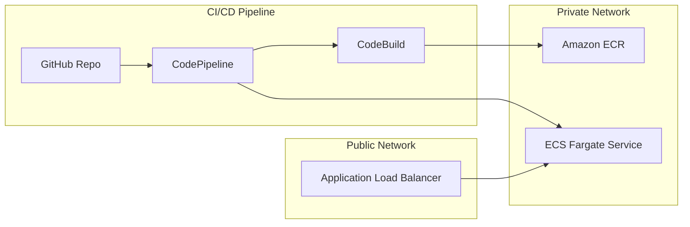

# AWS DevSecOps Infrastructure with Terraform

Deployment of a scalable CI/CD pipeline using AWS native services (ECS Fargate, CodeBuild, CodePipeline, and ALB).

## Architecture Diagram

Berikut adalah visualisasi hubungan antar layanan:



## Optional Features Implemented

Sesuai dengan panduan tugas, berikut adalah fitur opsional yang telah diimplementasikan:

- **Application Load Balancer (ALB)**: Terintegrasi penuh dengan ECS Service untuk distribusi traffic dan health monitoring.
- **S3 Artifact Store**: Konfigurasi bucket S3 khusus untuk menyimpan build artifacts secara aman selama proses pipeline.
- **Amazon ECR Management**: Penambahan modul ECR dengan Lifecycle Policy untuk manajemen lifecycle image otomatis.
- **KMS Encryption**: Enkripsi pada S3 artifacts dan ECR repository untuk keamanan data at rest.
- **SSL/HTTPS Support**: Konfigurasi ACM Certificate dan HTTPS Listener dengan HTTP Redirect.

## CI/CD Workflow

### 1. Infrastructure CI (GitHub Actions)

Setiap kali ada `push` atau `Pull Request` ke branch `main`, GitHub Actions akan menjalankan:

- **Format Check**: Memastikan penulisan kode sesuai standar HCL.
- **Validation**: Mengecek integritas sintaks Terraform.

### 2. Application CI/CD (AWS CodePipeline)

Setelah kode masuk ke branch `main`, pipeline AWS akan terpicu secara otomatis:

1. **Source Stage**: Mengambil kode terbaru dari GitHub.
2. **Build Stage (CodeBuild)**: Build Docker Image, Push ke ECR, dan Generate `imagedefinitions.json`.
3. **Deploy Stage (ECS)**: Melakukan Rolling Update pada ECS Service.

## Directory Structure

- `modules/`: Reusable components (VPC, ALB, ECS, ECR, CodeBuild, CodePipeline).
- `main.tf`: Root configuration (Example Usage).
- `variables.tf`: Variable definitions.
- `providers.tf`: Provider setup.
- `terraform.tfvars`: Environment configuration.

## Getting Started

### Prerequisites

- Terraform v1.0+
- AWS CLI installed and configured
- GitHub PAT (Personal Access Token)

### Installation & Setup

1. **Install AWS CLI**: [Official Page](https://aws.amazon.com/cli/).
2. **Configure AWS Credentials**: `aws configure` (Region: `ap-southeast-3`).

### Example Usage & Deployment

Infrastruktur ini dirancang secara modular. File `main.tf` di root direktori bertindak sebagai contoh penggunaan (example usage) yang menggabungkan seluruh modul menjadi satu kesatuan:

```hcl
# Contoh pemanggilan modul ECS yang terhubung dengan ALB
module "ecs" {
  source                = "./modules/ecs"
  name                  = var.project_name
  vpc_id                = module.vpc.vpc_id
  target_group_arn      = module.alb.target_group_arn
  alb_security_group_id = module.alb.alb_security_group_id
}
```

1. `terraform init`
2. `terraform plan`
3. `terraform apply`

## Tagging Strategy

Seluruh resource memiliki tag `Name` dan `Environment`. Konfigurasi ini dapat diubah secara terpusat melalui file `terraform.tfvars`.

## Assumptions & Limitations

- **GitHub Token**: Menggunakan PAT dengan izin repo.
- **Region**: Deployment ditargetkan untuk `ap-southeast-3` (Jakarta).
- **Secrets**: Disarankan menggunakan AWS Secrets Manager untuk produksi.
